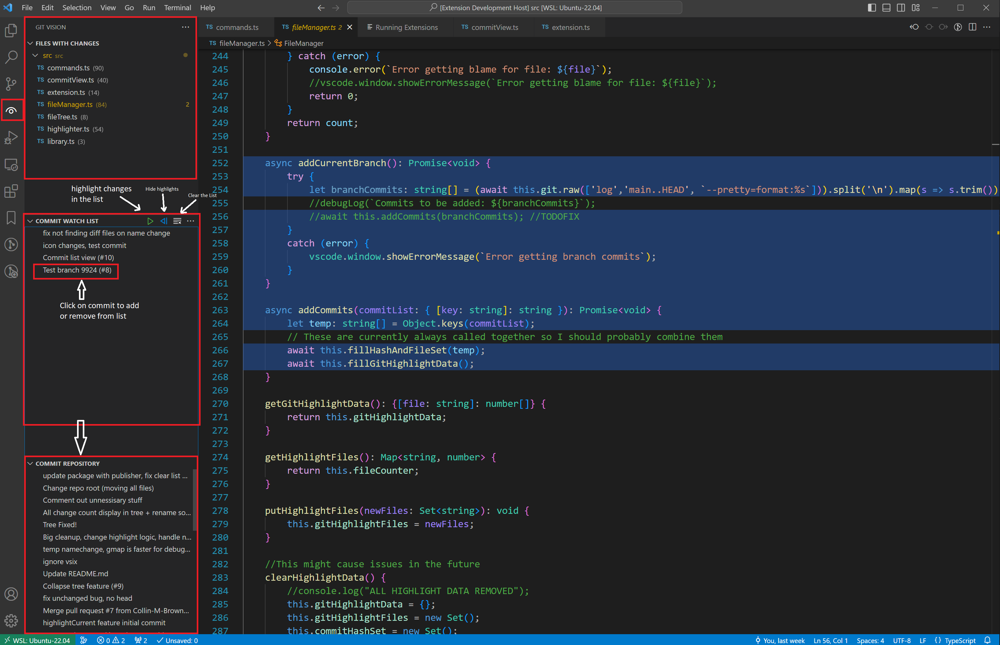
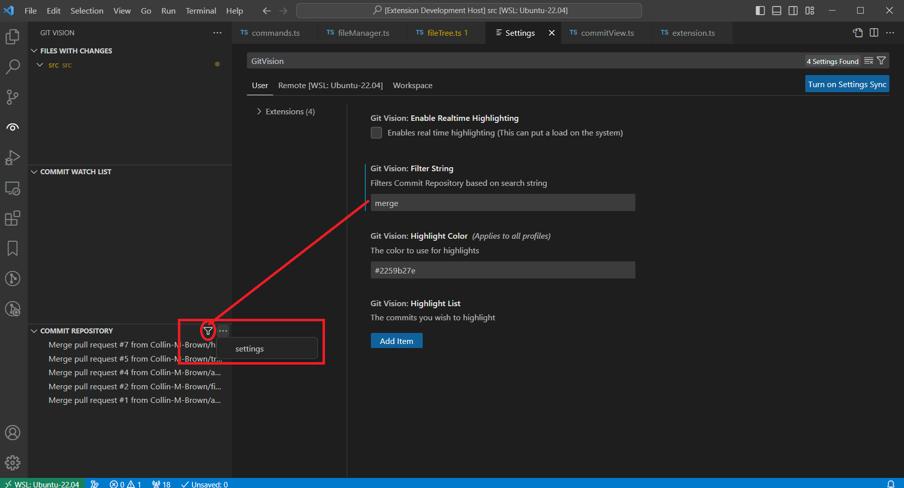

# GitVision
Highlight git blame data for multiple commits at once.
## Purpose
This extension aims to provide visiual aid for viewing past commits and branches merged when in a git repository. It is specifically designed for large collaborative repositories.
For an example; if you have multiple commits for a single feature merged to the repository, and you wish to view all the changes you have made on that feature, you can simply add all the relevant commits to a list, and then this extension will highlight all the lines that were changed in those commits.

This extension serves a similar purpose to a git heatmap but allows for tracking multiple commits at once.

## Requirements

vscode 1.82.2

## Extension Settings

Enable Real time highlighting

Highlight color

## Known Issues

* The highlights attempt to adapt to any current changes you make. But there are some cases
    where deleting and undoing changes can cause the highlights to be stack on top of each other.

* Merged branches that did not have the commits squashed will not show any changes when added to commit list. You will need to add the commits for the branch individually. If the merged branch was squashed, this will not be an issue.

* Tracking highlights and real time can cause flickering. I will add an option to enable or disable

## Notes
* Needs testing with larger repositories.
  
## Release Notes

0.0.2 Initial release

0.0.3 Add scroll bar decoration

### 1.0.0

Initial release of Git Vision

### 1.0.1

Add filter buttons and scroll bar highlights

### TODO
* Add way to search/filter commit list to find commits easier

* Add feature to save last used commit watch list so people don't have to re-add the commits every time they reload.
## For more information

https://github.com/Collin-M-Brown/Git-Vision
