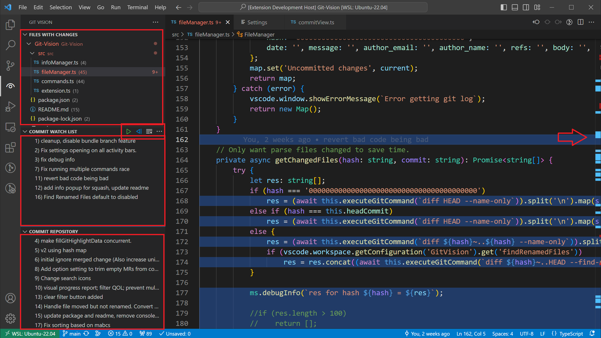
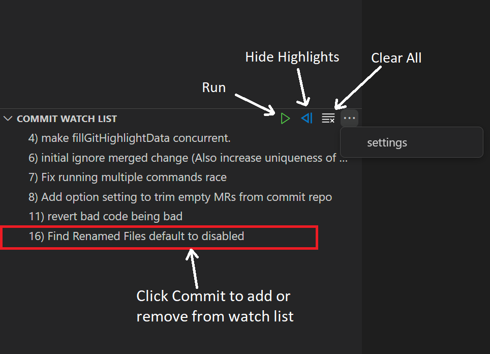
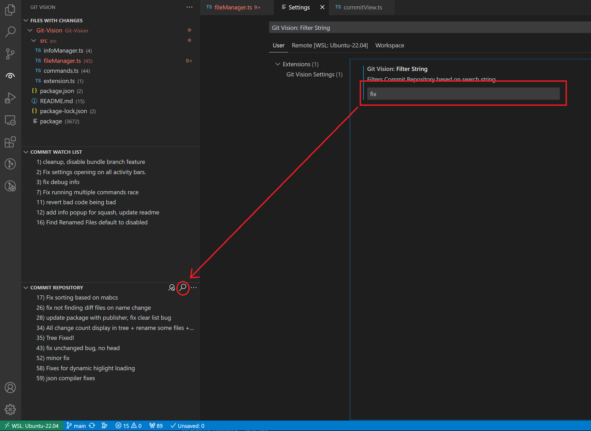

# GitVision
Highlight git blame to provide visual tracking for multiple commits simultaneously. 
## Purpose
This extension aims to provide visiual aid for viewing past commits and branches merged when in a git repository. It is specifically designed for large collaborative repositories.
For an example; if you have multiple commits for a single feature merged to the repository, and you wish to view all the changes you have made on that feature, you can simply add all the relevant commits to a list, and then this extension will highlight all the lines that were changed in those commits.

This extension serves a similar purpose to a git heatmap but allows for tracking multiple commits at once.

## Notes
Notes on merged commits:
When a branch is merged into another, a merged commit will be created. This commit will usually not appear in the git blame data unless conflicts were resolved in this commit.
A typical merged commit might look like this

    commit (Hash A)
    
    Merge: (Hash B) (Hash C)
    
    Author: (Name)
    
    Date: (Date)

    Merge branch 'branch A' into 'main'
    Commit message of merge request

in this case (Hash A)'s changes mirror its sibling commit but its changes wont show up in blame.

Therefore, merged commits are ignored by default. If a merged commit resolves conflicts in a way unique to both branches, then the merge commit will have blame attributed to it. If you want to see your merged commits you can enable all commits in the settings. Just be aware that most of the merged commits will be empty.

## Requirements

vscode 1.82.2

## Extension Settings

See settings tab

## Known Issues

  
## Release Notes

0.0.2 Initial release

0.0.3 Add scroll bar decoration

### 1.0.0

Initial release of Git Vision

### 1.0.1

Add filter buttons and scroll bar highlights

### 1.0.3

* Add option to bundle merged commits

* Add toggle option to search for git blame in renamed files (Disabled by default for performance)

* Add toggle for debug messages

* Fixed commit sorting on m based alphebet

### 1.0.4

* Bug fixes and QOL adjustments

### 1.2.0

* Optimize file reading speed
* Add mutex to block intensive commands from being run multiple times
* Add watchers for filter string, showAllCommits setting, and branch changes
* remove some features that were dated.

### TODO

* Add feature to save last used commit watch list so people don't have to re-add the commits every time they reload.

~~* Handle branch switch, auto reload commit repository an clear watch list.~~

* Add color option for highlights that scales with date

## Related extensions (inspirations)

* GitLense
* Git Blame
* Bookmarks

## Keywords
git git git git git git git git git git git 
git blame git blame git blame git blame git blame 
git highlighter git highlighter git highlighter git highlighter git highlighter 
source control source control source control source control source control source control 
code review code review code review code review code review code review 
feature branch highlighter feature branch highlighter feature branch highlighter

## For more information

https://github.com/Collin-M-Brown/Git-Vision
