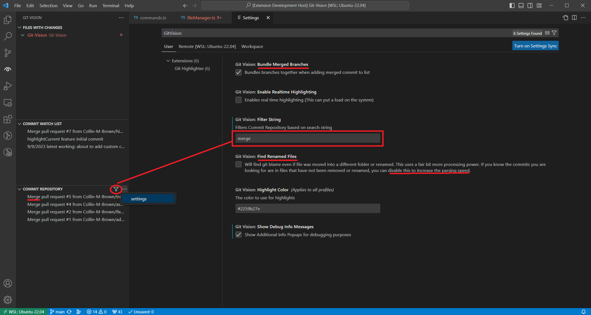

# GitVision
Highlight git blame to provide visual tracking for multiple commits simultaneously. 
## Purpose
This extension aims to provide visiual aid for viewing past commits and branches merged when in a git repository. It is specifically designed for large collaborative repositories.
For an example; if you have multiple commits for a single feature merged to the repository, and you wish to view all the changes you have made on that feature, you can simply add all the relevant commits to a list, and then this extension will highlight all the lines that were changed in those commits.

This extension serves a similar purpose to a git heatmap but allows for tracking multiple commits at once.

## Notes
Notes on merged commits not appearing in Commit Repo dropdown:
When a branch is merged into another, a merged commit will be created. This commit will usually not appear in the git blame data unless conflicts were resolved in this commit.
A typical merged commit might look like this
commit <Hash A>\n
Merge: <Hash B> <Hash C>\n
Author: <Name>\n
Date: <Date>\n
\t Merge branch 'branch A' into 'main'\n
\t Commit message of merge request

in this case <Hash A> will not show up as blame in any files unless the commit <Merge branch 'branch A' into 'main'>
had conflicts that were resolved.

Therefore, if there were not conflicts, I removed  <Merge branch 'branch A' into 'main'> from the commit repo, since there would be a lot of empty commits.

## Requirements

vscode 1.82.2

## Extension Settings

Enable Real time highlighting: (Allows for writing in between changes.)

Highlight color:

Bundle Merged Branches:

Find Renamed Files: (disabled by default)

Show Debug Info Messages: (Will show debug info popups when commands fail.)

## Known Issues

* The highlights attempt to adapt to any current changes you make. But there are some cases
    where deleting and undoing changes can cause the highlights to be stack on top of each other. (only occurs when real time highlighting is enabled.)

* Merged branches that did not have the commits squashed will not show any changes when added to commit list. You will need to add the commits for the branch individually. If the merged branch was squashed, this will not be an issue.

* Tracking highlights and real time can cause flickering. I will add an option to enable or disable
  
## Release Notes

0.0.2 Initial release

0.0.3 Add scroll bar decoration

### 1.0.0

Initial release of Git Vision

### 1.0.1

Add filter buttons and scroll bar highlights

### 1.0.3

* Add option to bundle merged commits

* Add toggle option to search for git blame in renamed files (Disabled by default for performance)

* Add toggle for debug messages

* Fixed commit sorting on m based alphebet

### 1.0.4

* Bug fixes and QOL adjustments

### TODO

* Add feature to save last used commit watch list so people don't have to re-add the commits every time they reload.

* Handle branch switch, auto reload commit repository an clear watch list.

* Add clear filter option

* Add color option for highlights that scales with date
## For more information

https://github.com/Collin-M-Brown/Git-Vision
